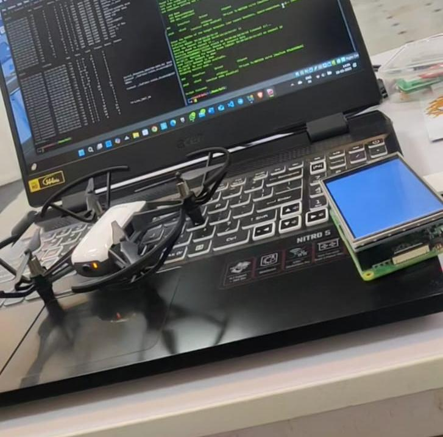
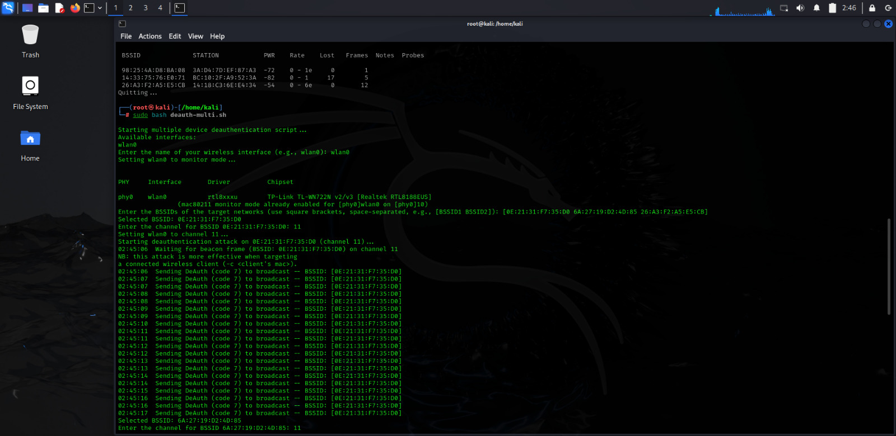
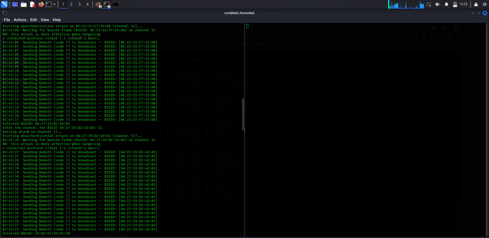

# Enhanced Drone Countermeasure System

**Utilizing Real-time De-Authentication Attacks with Raspberry Pi and Optimized Network Adapters**

Final Year B.E. Project — Computer Science & Engineering (Cyber Security)
Sathyabama Institute of Science and Technology, Chennai
Authors: **Giridhar S** (41614026), Tharun G (41614097)
Guide: Dr. N. Nanthini, M.E., Ph.D.
Presented at **ICIMSET 2025** (Dhanalakshmi College of Engineering)
Selected for showcase at **Technovation 2025**


---

## ⚠️ Disclaimer

This project was developed strictly for **academic research and educational purposes** as part of a final year engineering curriculum, tested only against a personally-owned Tello test drone in a controlled environment.

De-authentication attacks interfere with wireless communications and **may be illegal to perform against networks or devices you do not own or do not have explicit written authorization to test**, depending on your jurisdiction. The authors and repository do not condone or take responsibility for unauthorized or malicious use of this code. Use only in accordance with local laws and with proper authorization.

## 📄 Overview

Commercial anti-drone systems (RF jamming, GPS spoofing, kinetic interception) are expensive, legally complicated, and often disrupt legitimate nearby devices. This project implements a low-cost, targeted alternative: a Raspberry Pi + TP-Link high-gain Wi-Fi adapter (monitor mode + packet injection) that detects Wi-Fi–based drones and disrupts only their communication link via IEEE 802.11 de-authentication frames.

**Key results (controlled test environment):**

| Metric | Value |
|---|---|
| Detection Accuracy | 92.5% |
| False Positive Rate | 4.8% |
| Avg. Response Time | 1.2 s |
| De-auth Success Rate | 88.7% |
| System Uptime | 99.2% |

## 🧰 Hardware

- Raspberry Pi 4 Model B
- TP-Link TL-WN722N (v2/v3, Realtek RTL8188EUS chipset) high-gain Wi-Fi adapter
- 5V/3A power supply or power bank
- MicroSD card (32GB+, Class 10)
- DJI Tello drone (test target)

## 💻 Software

- Kali Linux ARM / Raspberry Pi OS
- Aircrack-ng suite
- Python 3.x, Scapy
- Bash

## 🚀 Usage

```bash
git clone https://github.com/<your-username>/drone-countermeasure.git
cd drone-countermeasure/src
chmod +x deauth-multi.sh
sudo ./deauth-multi.sh
```

The script will prompt you interactively for:
- your wireless interface name
- the target BSSID(s)
- the channel for each target

No credentials, network names, or personal identifiers are hardcoded — everything sensitive is supplied at runtime.

## 🏆 Showcase

Selected for showcase at **Technovation 2025** — competitive selection among student projects, presented as a live hardware demo (Raspberry Pi 4 + TP-Link TL-WN722N + Tello test drone).



## 🖥 Output

Live de-authentication attack running against test-range BSSIDs (Kali Linux, TP-Link TL-WN722N v2/v3):




## 📁 Repository Structure

```
drone-countermeasure/
├── README.md
├── LICENSE
├── DISCLAIMER.md
├── docs/
│   └── final_report.pdf        # (optional — see note below)
├── images/
│   ├── tello-drone-technovation2025.jpg
│   ├── deauth-scan-start-terminal.jpg
│   └── deauth-continue-terminal.jpg
└── src/
    └── deauth-multi.sh
```

## 📚 Reference

Giridhar S, Tharun G, Dr. N. Nanthini, *"Enhanced Drone Countermeasure System Utilizing Real-Time De-Authentication Attacks with Raspberry Pi and Optimized Network Adapter,"* presented at the International Conference on Innovation of Materials, Science and Engineering Technology (ICIMSET 2025).

## 📜 License

**Ethical Use & Research License (EURL) v1.0** — a custom license, not MIT/Apache. It permits academic and authorized security research use, and explicitly **prohibits** unauthorized deployment, malicious use, commercial resale, and use against systems you don't own or aren't authorized to test. See [LICENSE](LICENSE) for full terms, and [DISCLAIMER.md](DISCLAIMER.md) for the legal disclaimer.
